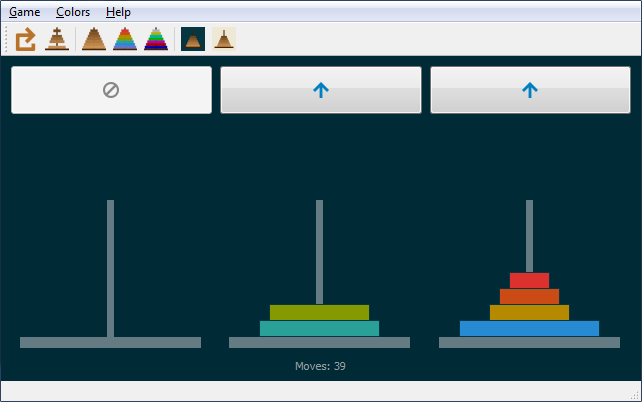
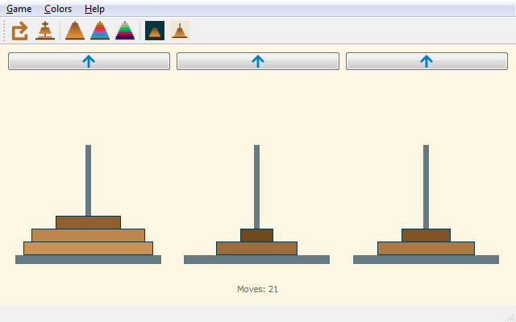

# Tower of Hanoi
Simple old puzzle game written in Python & Qt for Python (PySide2)

https://en.wikipedia.org/wiki/Tower_of_Hanoi

Screenshot:

Screenshot:

### To do:
* allow to play by clicking on the towers themselves (and possibly remove the pushbuttons)
* polish source code - write docstrings, more explanatory comments, more explanatory names (self.content, self.hand, self.content.hand...)