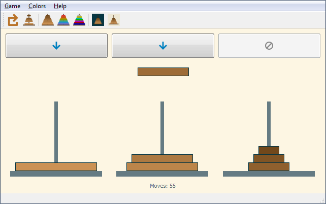

# Tower of Hanoi
Simple old game written for Python 3 + PySide2

https://en.wikipedia.org/wiki/Tower_of_Hanoi

### to do:
* write a short info about the rules of the game (Help > How to play, add icon of e.g. a book)
* allow to play by clicking on the towers themselves (and possibly remove the pushbuttons)
